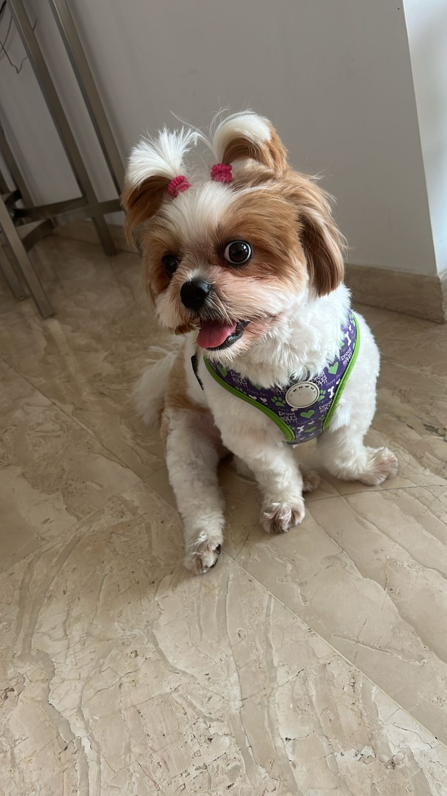

# Welcome to My User Page!

## About Me
Hi! I'm **Ryan**, a passionate programmer and student at UCSD majoring in Computer Science and minoring in Economics. I love building meaningful software and exploring how code can solve real-world problems.

> "Code is like humor. When you have to explain it, it’s bad." – Cory House

## Skills and Interests
- Data Analysis
- Dance
- Cricket
- C++, Python, Java
- Football, Math, and Reading

## Here's a Picture of My Dog Sky

> Sky is our 4-year-old dog who loves food, naps, and chasing her favorite toy!

## Code Snippet
Here's a simple Python function I wrote:

```python
def greet(name):
    return f"Hello, {name}!"
```

## Link to my LinkedIn
[LinkedIn](https://www.linkedin.com/in/ryan-awal/)

## Have I told you what I like?
[About Me](#skills-and-interests)

## Want to know my favorite programming language?
[Click here to find out](README.md)

## What I am doing tonight
1. Making Dinner
2. Eating Dinner
3. Washing Dishes
4. Playing Pickleball
5. Hopefully Sleep

## My values
- Integrity
- Courage 
- Gratitude
- Creativity

## HW this weekend
- [x] EDS WEEK 2 COURSERA
- [ ] CSE 150B PA1
- [ ] CSE 153R Lab 1
- [x] DSGN 1 Journal
- [ ] DSGN 1 Project

